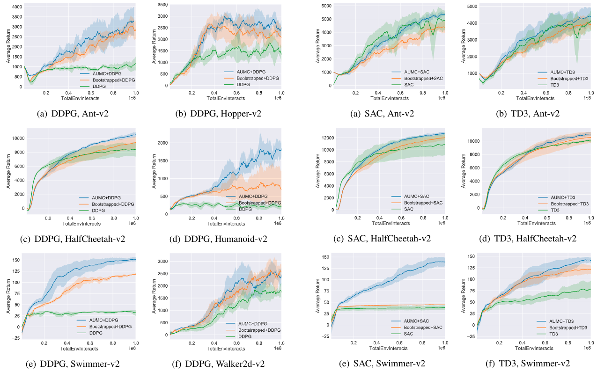

## Attentive Update of Multi-Critic for Deep Reinforcement Learning

PyTorch implementation of paper "Attentive Update of Multi-Critic (AUMC)" which is accepted as ICME-2021 oral paper.
Method is tested on MuJoCo continuous control tasks in OpenAI Gym. Agents are trained using PyTorch 1.4 and Python 3.6.

## Instructions
### Recommend: Run with Docker
```bash
# python        3.6    (apt)
# pytorch       1.4.0  (pip)
# tensorflow    1.14.0 (pip)
# DMC Control Suite and MuJoCo
cd dockerfiles
docker build . -t aumcRL
```
For other dockerfiles, you can go to [RL Dockefiles](https://github.com/LQNew/Dockerfiles).

### Launch experiments
Run with the scripts `batch_aumc_mujoco_4seed_cuda.sh`:
```bash
# eg.
bash batch_aumc_mujoco_4seed_cuda.sh Hopper-v2 DDPG_aumc 0 0.4 # env_name: Ant-v2; algorithm: DDPG coupled with AUMC; CUDA_Num : 0; beta: 0.4.
```

### Visualization of the environments
Run with the scripts `render_mujoco.py` / `render_aumc_mujoco.py`:
```bash
# eg. visulization of the environments with random actions:
python render_mujoco.py --env Ant-v2  # env_name: Ant-v2

# or visulization of the environments with trained policy:
CUDA_VISIBLE_DEVICES=0 python render_bootstrapped.py \
    --policy "TD3_aumc" \
    --env "Ant-v2" \
    --load_model "default" \
    --seed 2  
# env_name: Ant-v2; load policy: policy trained with TD3_aumc with seed equaling 2
```

### Performance on MuJoCo
Including `Ant-v2`, `HalfCheetah-v2`, `Hopper-v2`, `Humanoid-v2`, `Swimmer-v2`, `Walker2d-v2`.

<br>
